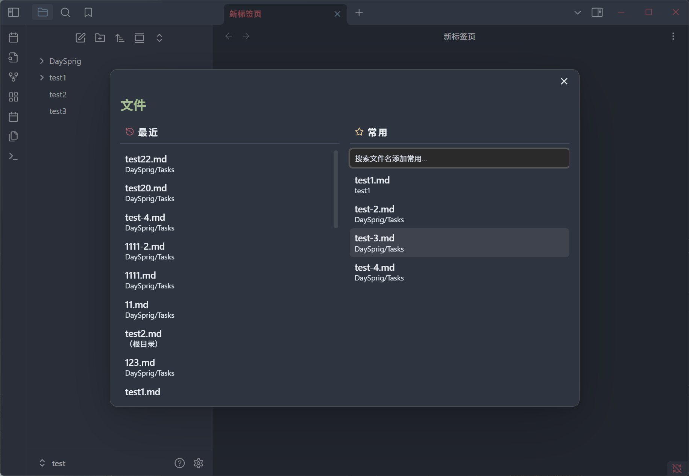
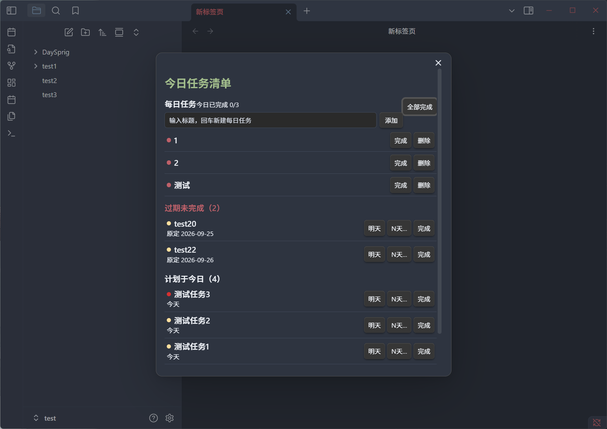
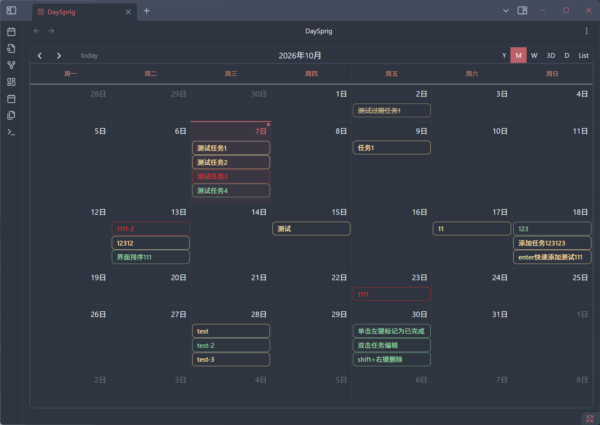
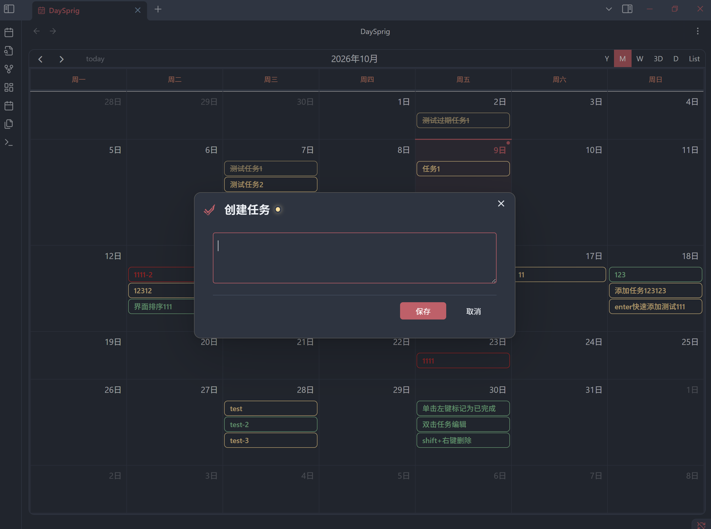
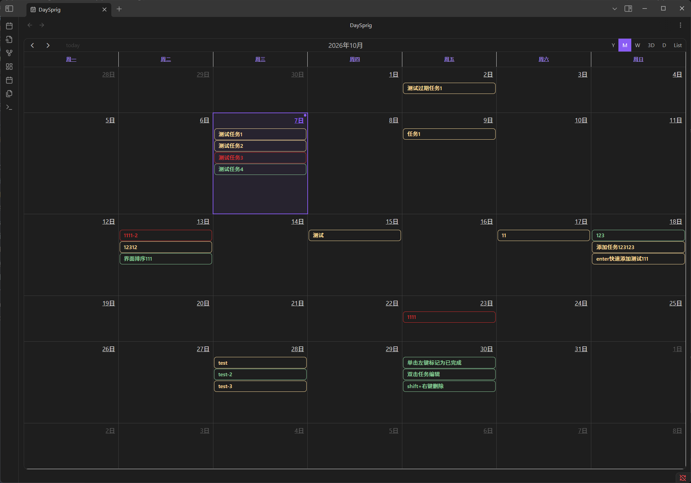
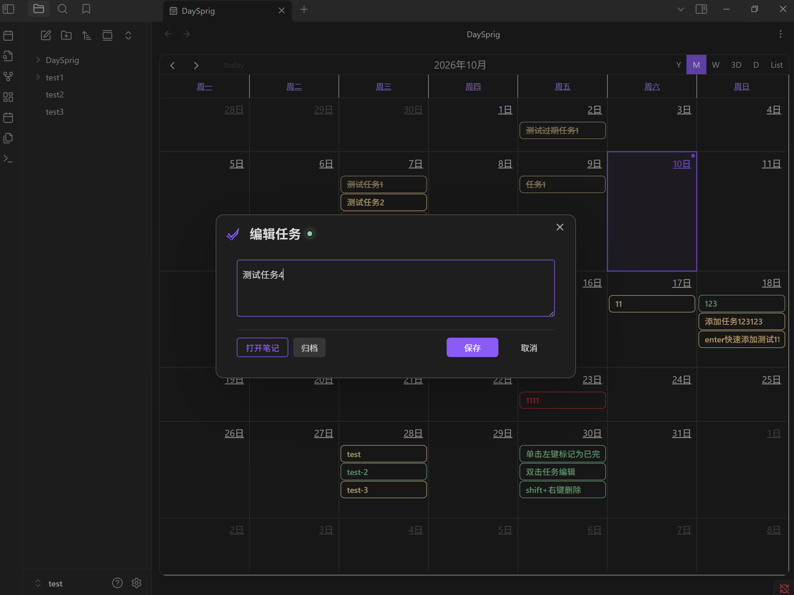
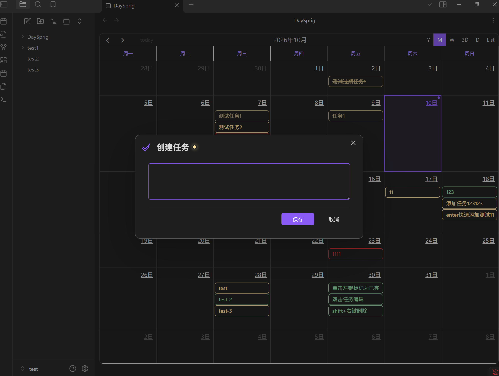
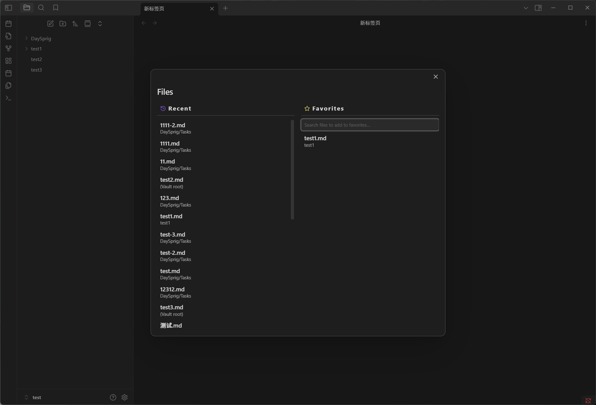
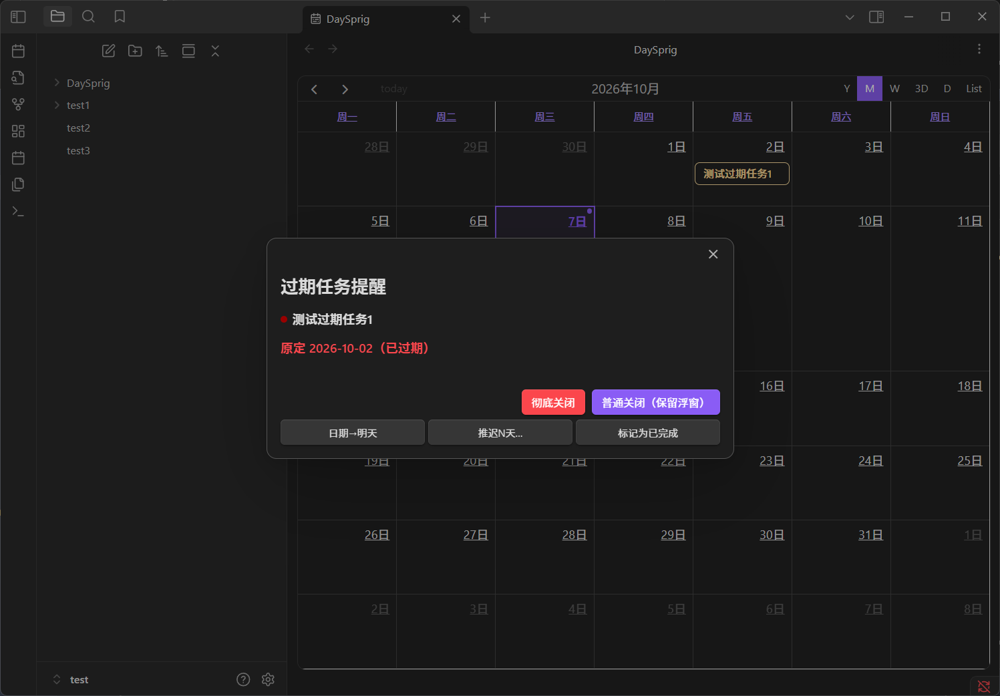

# DaySprig

DaySprig is a standalone desktop task calendar for Obsidian. It brings the calendar, task notes, reminders, daily checklist, and recent files into one lightweight workflow.

[中文说明](README.md)

## Plugin Overview

DaySprig is recommended with the [Obsidian Nord](https://github.com/insanum/obsidian_nord) theme for the best visual result:

  
  
  
  

## Core Features

### Calendar and Task Editing

The calendar is the main DaySprig view. Press Ctrl+Shift+R to open or close it.

Left-click a task to toggle its completion status.

Right-click a task to cycle through its priority levels.

Shift-right-click a task to delete it immediately.

Double-click a task to open the edit window.

Left-click a date to create a task for that day:

### Today List

Press Ctrl+Shift+D to open the Today list. It supports adding daily tasks and displays daily tasks, overdue tasks, and tasks planned for today.

### Recent Files and Favorites

Press Ctrl+Shift+Q to open Recent files and Favorites.

### Overdue Reminders

Unfinished tasks trigger automatic reminders when they become overdue.

## Default Shortcuts

| Action | Windows/Linux | macOS |
| --- | --- | --- |
| Open/close DaySprig | Ctrl+Shift+R | Cmd+Shift+R |
| Open/close Today list | Ctrl+Shift+D | Cmd+Shift+D |
| Open/close Recent files | Ctrl+Shift+Q | Cmd+Shift+Q |

You can change these shortcuts in Obsidian under Settings → Hotkeys.

## Installation

1. Download the installer archive `daysprig-VERSION.zip`, for example `daysprig-0.1.0.zip`, from the assets of a [DaySprig release](https://github.com/Felix-Ashford/DaySprig/releases). GitHub's automatically generated “Source code (zip)” is the source archive, not the installer.
2. Extract the archive and copy the resulting `daysprig` folder into your vault's `.obsidian/plugins/` folder. If you use a custom configuration directory, copy it into that directory's `plugins/` folder. The final paths should be `.obsidian/plugins/daysprig/manifest.json`, `main.js`, and `styles.css`; avoid an extra nested `daysprig` folder.
3. Reload or restart Obsidian, then enable DaySprig under Settings → Community plugins.
4. Open DaySprig settings and confirm the task folder, archive folder, language, and calendar behavior.

For a manual update, overwrite the plugin files with the files from the new archive and keep the existing `data.json` so your settings and checklist data remain available.

## Local Data

Plugin settings, reminder state, and daily checklist data are stored in the plugin's `data.json`. Task data and task fields are stored in vault notes. Do not upload personal vault content or `data.json` to a public repository.

## Development and Releases

Node.js 22 or later is required. Common checks are `npm ci`, `npm run build`, `npm test -- --runInBand`, and `npm run test:build`. Create a release package with `npm run release:package`.

## Community

Thanks to the [LINUX DO](https://linux.do/) community for providing an open and friendly platform for technical discussions.

## License and Attribution

DaySprig is based on the [TaskNotes](https://github.com/callumalpass/tasknotes) plugin for Obsidian.

DaySprig modifications are Copyright 2026 Felix-Ashford. The TaskNotes baseline is Copyright 2025 Callum Alpass. The project is provided under the [MIT License](LICENSE). See [NOTICE.md](NOTICE.md) for provenance and [THIRD-PARTY-NOTICES.md](THIRD-PARTY-NOTICES.md) for dependency licenses.
