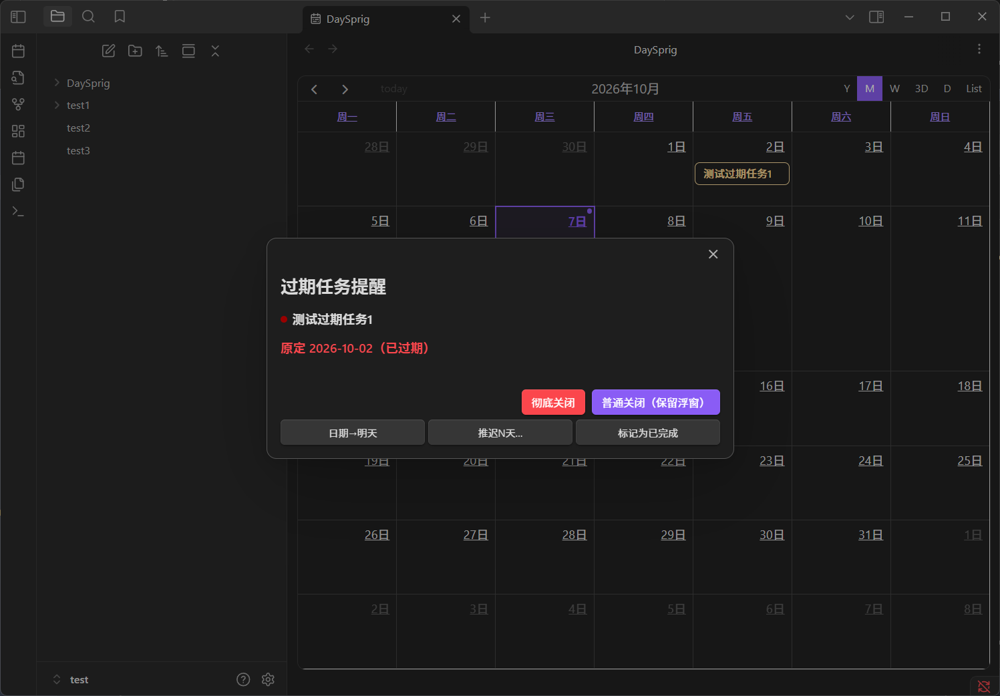
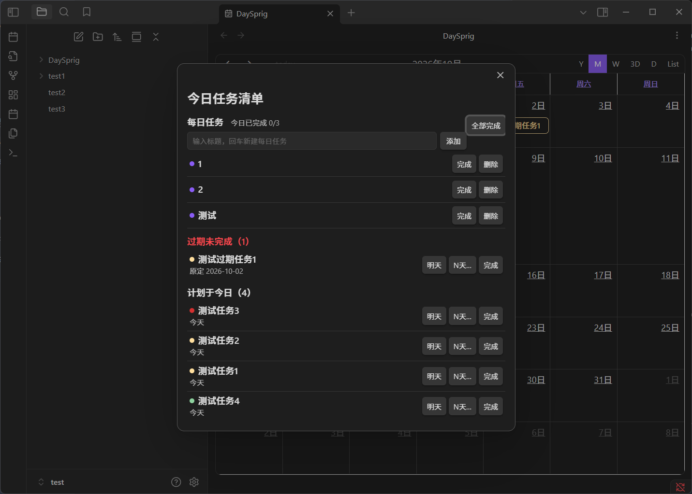

# DaySprig

DaySprig 是一款面向 Obsidian 的桌面任务日历插件，默认使用中文界面。它把日历、任务笔记、提醒、每日清单和最近文件集中在一个轻量工作流中，不需要安装 TaskNotes。

[English](README.en.md)

## 界面预览

### 日历与任务编辑

日历是 DaySprig 的主界面。任务按日期显示，颜色对应任务重要度；双击任务打开编辑窗口，左键空白日期可按设置决定是否创建当天笔记。

创建和编辑任务使用同一种文本框：第一行是任务名称，后续内容是详情。按 Enter 保存；保存后再次按 Enter，可以在同一天继续创建下一项任务。编辑窗口会原样显示此前保存的内容。

### 今日清单、最近文件与设置

Ctrl/Cmd+Shift+D 打开今日任务清单，按过期、今日计划、今日截止和已完成分组。Ctrl/Cmd+Shift+Q 打开最近文件和常用文件，支持搜索、排序、重命名、复制内部链接和移入回收站。设置中可以选择界面语言、任务和归档目录、日历行为、重要度颜色及保留的快捷键。

DaySprig 也可以配合 Obsidian 主题使用：

## 主要功能

- 月视图日历：查看计划日期、截止日期、循环任务和任务重要度。
- 任务操作：左键切换完成状态，双击编辑，右键循环切换重要度，Shift+右键直接删除且不再确认；Ctrl/Cmd+左键在新标签页打开任务笔记。
- 创建任务：日历中单击日期（如果在设置中开启）即可创建当天笔记；创建窗口支持标题、详情和重要度调整。
- 连续创建：创建任务按 Enter 保存后，回到日历再次按 Enter 可在同一天打开新的创建窗口。
- 编辑任务：编辑窗口按 Enter 保存，不会误触发连续创建；任务内容以普通文本原样编辑。
- 提醒：高重要度或过期任务支持推迟日期、完成任务和浮窗提示。
- 今日任务清单和最近文件窗口支持语言切换时即时刷新。
- 支持中文、English、Français、Deutsch、Español、日本語和 Русский。
- 默认任务目录为 DaySprig/Tasks，归档目录为 DaySprig/Archive，均可在设置中调整。

ICS 订阅与导出、HTTP API/Webhook、Pomodoro、独立统计、看板、独立 Agenda 视图、Bases 集成和时间追踪已从当前工作流中移除。

## 默认快捷键

| 操作 | Windows/Linux | macOS |
| --- | --- | --- |
| 打开/切换 DaySprig | Ctrl+Shift+R | Cmd+Shift+R |
| 打开/关闭今日任务清单 | Ctrl+Shift+D | Cmd+Shift+D |
| 打开/关闭最近文件 | Ctrl+Shift+Q | Cmd+Shift+Q |

快捷键可以在 Obsidian 的“设置 → 快捷键”中修改。设置界面只保留当前版本仍有作用的快捷键。

## 安装

1. 从 [DaySprig Releases](https://github.com/Felix-Ashford/DaySprig/releases) 下载 main.js、manifest.json 和 styles.css。
2. 将三个文件复制到 vault 的 .obsidian/plugins/daysprig 目录。
3. 在 Obsidian 的“设置 → 社区插件”中启用 DaySprig。
4. 在 DaySprig 设置中确认任务目录、归档目录、语言和日历行为。

任务仍然是普通 Markdown 笔记，不需要转换已有文件。首次使用前建议备份 vault，并先在测试 vault 中确认目录和日历设置。

## 本地数据

插件设置、提醒状态和每日清单保存在插件自己的 data.json 中；任务和时间字段保存在 vault 笔记内。不要将个人 vault 内容或 data.json 上传到公开仓库。

## 开发与发布

需要 Node.js 22 或更高版本。常用检查命令：npm ci、npm run build、npm test -- --runInBand、npm run test:build。发布打包使用 npm run release:package。

正式发布前仍应在 Obsidian 中手动测试日历、创建、编辑、删除、快捷键、语言切换和文件操作。

## 许可证与致谢

DaySprig 的修改部分版权归 Felix-Ashford 所有，TaskNotes 基线版权归 Callum Alpass 所有；项目采用 [MIT License](LICENSE)。来源说明见 [NOTICE.md](NOTICE.md)，依赖许可见 [THIRD-PARTY-NOTICES.md](THIRD-PARTY-NOTICES.md)。
